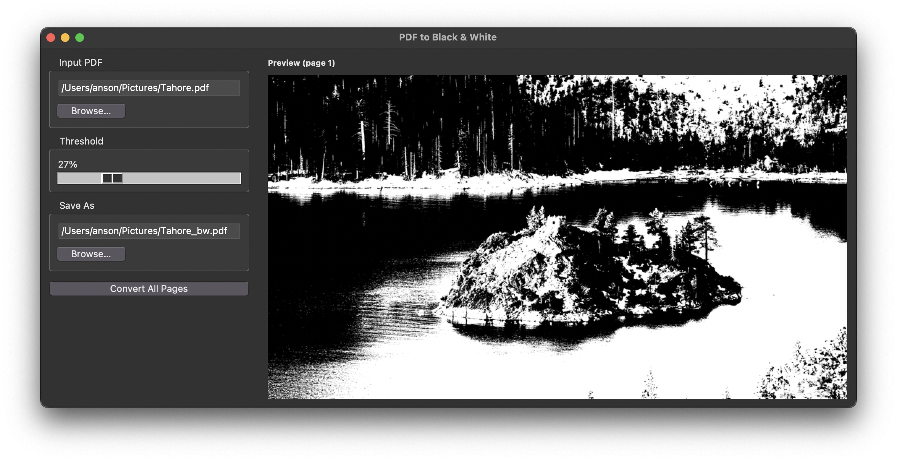

# bw-pdf

Convert scanned PDF pages to black and white (binarization). Reduces file size, ideal for archiving and printing.

Provides both a **command-line tool** and a **graphical interface**.

---

## Installation

```bash
pip install pymupdf pillow tqdm
```

The GUI uses `tkinter` (Python standard library). On Linux it may need to be installed separately:

```bash
# Ubuntu / Debian
sudo apt install python3-tk

# Fedora
sudo dnf install python3-tkinter
```

---

## CLI Usage

### Basic

```bash
python3 -m pdf2bw input.pdf output.pdf
```

Omitting the output path automatically generates `input_bw.pdf`:

```bash
python3 -m pdf2bw input.pdf
```

### Options

| Argument | Description | Default |
|----------|-------------|---------|
| `-t`, `--threshold` | Binarization threshold (0–255) | `128` |
| `--dpi` | Render DPI; higher = sharper but larger | `200` |
| `-s`, `--silent` | Hide progress bar, only print results/errors | |

### Examples

```bash
# Default threshold
python3 -m pdf2bw scan.pdf scan_bw.pdf

# Higher threshold → more areas turn white
python3 -m pdf2bw scan.pdf -t 160

# Higher DPI for sharper output
python3 -m pdf2bw scan.pdf --dpi 300

# Silent mode, suitable for scripting
python3 -m pdf2bw scan.pdf -s
```

---

## GUI Usage

```bash
python3 -m gui
```



> The image shown as the example comes from Bing Wallpaper.

The window is split into two panels:

- **Left — control panel**
  - Browse for input PDF and output destination
  - Drag the threshold slider (0%–100%) for a **live preview** of the first page
  - Click "Convert All Pages" to start; the progress bar shows status
- **Right — preview area**
  - Shows the first page rendered in black and white at the current threshold

Conversion runs in a background thread so the UI stays responsive.

---

## Library API

```python
from pdf2bw import pdf_to_bw_bytes, pdf_to_bw, render_first_page_preview

# Convert the whole PDF and return raw bytes
data = pdf_to_bw_bytes("input.pdf", threshold=128, dpi=200)
with open("output.pdf", "wb") as f:
    f.write(data)

# Or write directly to a file
pdf_to_bw("input.pdf", "output.pdf", threshold=128, silent=True)

# Preview the first page (returns a PIL.Image)
img = render_first_page_preview("input.pdf", threshold=100)
img.show()
```

### Progress callback

`pdf_to_bw_bytes` accepts a `progress_callback` — called as `fn(current, total)` after each page:

```python
def on_progress(current, total):
    print(f"{current}/{total}")

pdf_to_bw_bytes("input.pdf", progress_callback=on_progress)
```

---

## How It Works

1. **PyMuPDF** renders each PDF page as an RGB image (DPI is adjustable)
2. **Pillow** converts the image to grayscale and applies threshold binarization (pixels below the threshold become black, the rest white)
3. The binarized images are embedded into a new PDF and compressed

---

## Project Structure

```
bw-pdf/
├── pdf2bw.py      # Core logic + CLI entry point
├── gui.py         # Tkinter GUI
├── pyproject.toml # Project config and dependencies
└── README.md      # This file
```
